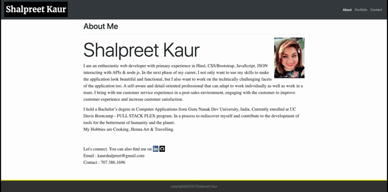
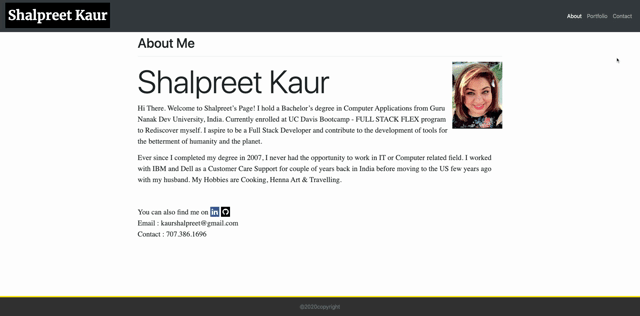

# Responsive Portfolio
## Description
 This project is a simple 3 HTML page project showcasing my Bio, Portfolio and Contact pages using Bootstrap. This is my first project in which I have created something from scratch using Bootstrap classes and minimum use of CSS. I have learnt a lot in this journey of creating my own Bio and Portfolio Page. [The project can be accessed at my github repository](https://github.com/kaurshalpreet/homework2)
 

 ---

# Table of Contents
1. Getting Started
1. Running the application
1. Responsive Layout
1. Credits
---

## Getting Started
This is 3 page HTML project consisting of index.html, portfolio.html & contact.html.
Each page has a consistent navigation bar and a sticky footer. Each page has a link to navigate to other pages. This project utilizes bootstap classes for building html wireframe, container, rows, columns etc. 
"About Me" is the main page about myself and has links to my LinkedIn & facebook profile.
"Portfolio" dispalys my interests and recent projects.
"Contact" provides option to contact me through the webpage.

Each page is designed to be responsive for mobile screen. Below images show the different view on  a large screen vs a small screen.

  |  

---

## Running the Application

[The index.html page can be accessed via github page here](https://kaurshalpreet.github.io/homework2/index.html)

The index.html has links to my LinkedIn, Facebook & Github profiles. You can also navigate to portfolio and contact pages.

---

## Responsive Layout
The webpages are designed to be responsive for viewing on mobile devices. On an `xs` screen, content takes up the entire screen. On `sm` and larger screens, some margins on the left and right sides of the screen will be observed.

When viewed on mobile device, the navigation links get collaopsed into a navigation icon. When clicked on the navigation icon, it displays the navigation menu.

The images also display responsive behavior when viewed on small screen.

---

## Credits
* UC Davis BootCamp-Instructor & TAs!
* https://getbootstrap.com/
* https://www.youtube.com/watch?v=5GcQtLDGXy8
* https://www.youtube.com/watch?v=cHAcSQyvBqQ

 
